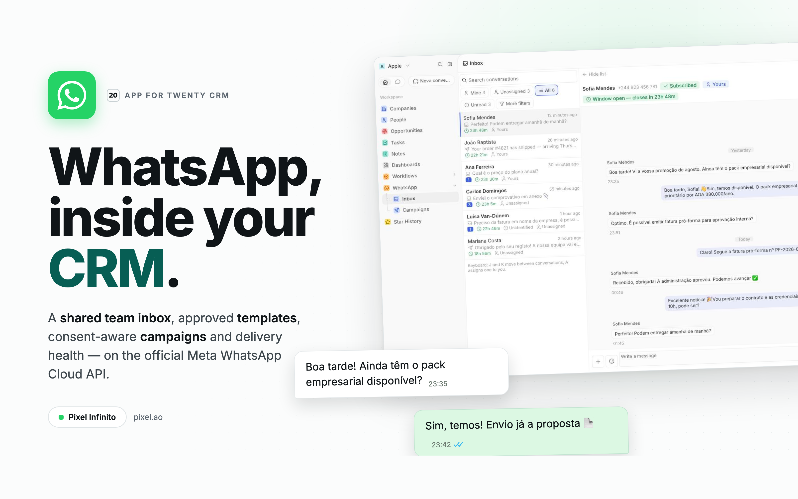
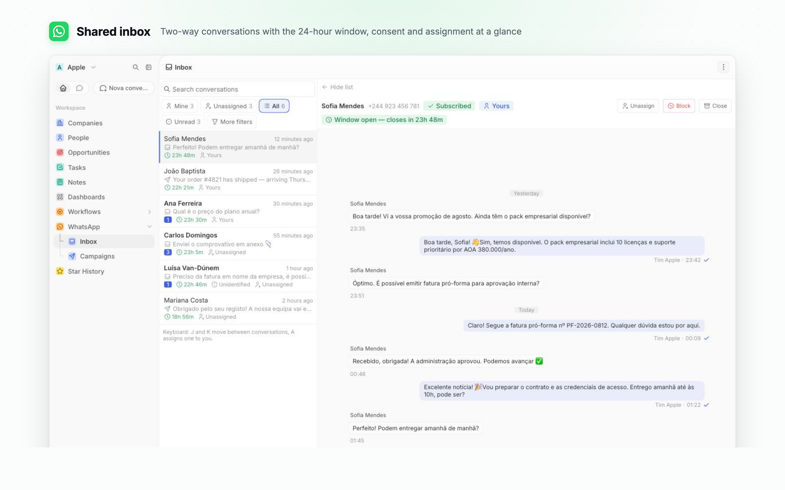
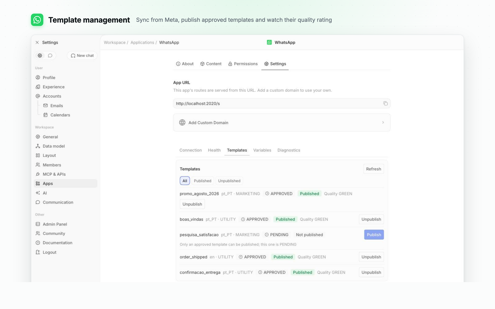
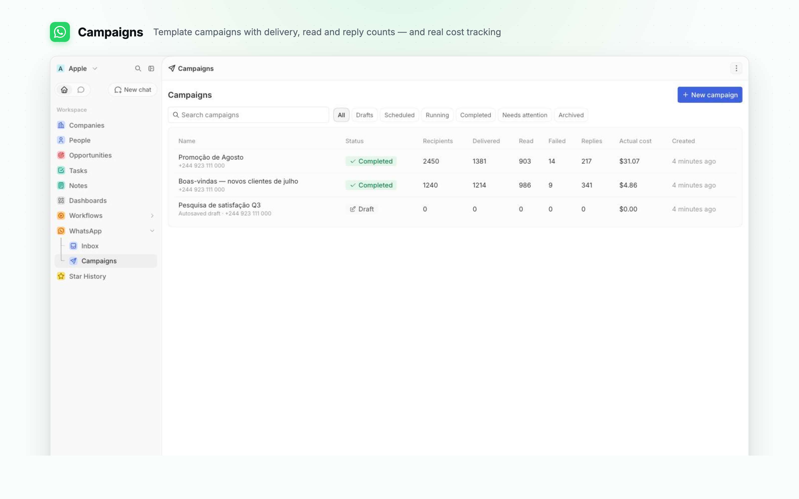

# WhatsApp for Twenty CRM

Two-way WhatsApp messaging inside [Twenty](https://twenty.com): a shared team inbox, conversations on every Person record, approved templates, consent tracking and marketing campaigns — powered by the official **Meta WhatsApp Cloud API**.

Developed by **Marcos Lisboa** at [Pixel Infinito](https://pixel.ao) · published as [`@pixelinfinito/twenty-app-whatsapp`](https://www.npmjs.com/package/@pixelinfinito/twenty-app-whatsapp).



## What you get

**A shared team inbox.** Filter by yours, unassigned, everyone's, unread or closed. Assignment, blocking and closing are one click, keyboard navigation included, and every action lands on the contact's timeline.



**The 24-hour rule, enforced server-side.** The composer always knows whether you may type: window state, consent, blocking, number quality and template availability are decided by the server and explained in the interface — never silently hidden.

**Templates you can actually use.** Sync from Meta, see which are approved, publish the ones the CRM may render, and fill their parameters from CRM fields with a live preview before sending.



**Campaigns with brakes.** Build an audience from a saved view, bind template parameters per recipient, get a cost estimate before launch — while a share of the daily tier is held back for 1:1 traffic and a circuit breaker pauses any campaign whose failure rate climbs.



**Consent that holds up.** Opt-out and opt-in keywords, a single confirmation reply whose wording is a setting rather than a deploy, and an audit event recorded for every change.

**Operations you can see.** A health panel that names which of six things is wrong and what to do about it, the exact callback URL and webhook fields to paste into Meta, and diagnostics for failed deliveries and stuck sends.

**Everything WhatsApp sends, handled.** Text, images, audio, video, documents, stickers, locations, contact cards, reactions and replies all render; anything Meta invents next is stored and shown as an unsupported message rather than dropped.

The interface ships in **English and Portuguese**, following each user's locale.

## Requirements

- A Twenty workspace (cloud or self-hosted) whose public URL is reachable over HTTPS — Meta must be able to call your webhook.
- A Meta Business account with an approved **WhatsApp Business phone number**.
- A Meta app with the WhatsApp product and a system-user access token.

## Installation

Install from **Settings → Apps** in your Twenty workspace, then connect Meta:

### 1. Create and configure a Meta app

- In [Meta for Developers](https://developers.facebook.com), create an app of type **Business** and add the **WhatsApp** product.
- From **App Dashboard → Settings → Basic**, copy the **App ID** and **App Secret**.

### 2. Create credentials

- In **Business Manager → System Users**, create a system user with access to your WhatsApp Business Account.
- Generate a long-lived token with exactly these scopes:
  - `whatsapp_business_management`
  - `whatsapp_business_messaging`
- Generate a random verify token (for example `openssl rand -hex 32`).

### 3. Add the secrets in Twenty

Open **Settings → Apps → WhatsApp → Settings → Variables** and set:

| Variable | Value |
| --- | --- |
| `META_APP_ID` | App ID from step 1 |
| `META_APP_SECRET` | App Secret from step 1 |
| `META_ACCESS_TOKEN` | System-user token from step 2 |
| `META_VERIFY_TOKEN` | Your random verify token |

### 4. Configure the webhook in Meta

Meta takes **one** callback URL and uses it for two things: a `GET` carrying `hub.challenge` to verify the endpoint, and `POST` to deliver events. Twenty answers those on two different paths:

| | Path | Answered by |
| --- | --- | --- |
| `GET` verification | `<base>/s/whatsapp/verify` | `wa-webhook-verify` |
| `POST` events | `<base>/webhooks/server/bb76f114-7843-4a09-af64-9ceca78479cd` | `wa-webhook-resolver` |

So add a one-line alias to the reverse proxy in front of Twenty that method-splits a single public path. **Caddy:**

```caddy
example.com {
    @wa_verify { path /whatsapp/webhook
                 method GET }
    @wa_events { path /whatsapp/webhook
                 method POST }

    handle @wa_verify {
        rewrite * /s/whatsapp/verify?{query}
        reverse_proxy twenty:3000
    }
    handle @wa_events {
        rewrite * /webhooks/server/bb76f114-7843-4a09-af64-9ceca78479cd
        reverse_proxy twenty:3000
    }
    handle { reverse_proxy twenty:3000 }
}
```

**Nginx:**

```nginx
location = /whatsapp/webhook {
    if ($request_method = GET)  { rewrite ^ /s/whatsapp/verify?$args last; }
    if ($request_method = POST) { rewrite ^ /webhooks/server/bb76f114-7843-4a09-af64-9ceca78479cd last; }
    return 405;
}
```

Do **not** let the proxy buffer, re-encode or otherwise rewrite the request body: the HMAC is computed over the exact bytes Meta sent, and any normalisation invalidates every signature.

Then open **Webhooks** in the Meta app's WhatsApp product and set the callback to:

```
<your Twenty base URL>/whatsapp/webhook
```

> If your Twenty version routes `GET` to server routes, you can skip the proxy and paste `<base>/webhooks/server/bb76f114-7843-4a09-af64-9ceca78479cd` directly — the resolver answers the handshake there too. Check first with
> `curl "<base>/webhooks/server/bb76f114-7843-4a09-af64-9ceca78479cd?hub.mode=subscribe&hub.challenge=probe&hub.verify_token=<your token>"`.
> If that returns `probe`, you are fine. If it returns HTML, your version does not, and you need the alias above.

Use the same verify token, and subscribe these fields: `messages`, `message_template_status_update`, `message_template_quality_update`, `message_template_components_update`, `account_update`, `phone_number_quality_update`, `business_capability_update`.

The app's **health panel** shows all three URLs and the required fields for your workspace, and verifies each piece of the setup once a number is connected.

### 5. Connect your number

In the app settings, connect your WABA and phone number, run the health check, and sync templates. You're live.

### Troubleshooting

Seeing `unverified webhook`, `signature failed`, or no events?

- Confirm the proxy alias from step 4 exists. A callback URL that verifies but delivers nothing is the classic symptom of a `GET` rule without its `POST` counterpart — Meta's "Send to my server" test then hits a 404 you will only see in the proxy log.
- Re-copy the callback URL and verify token into Meta from the latest save.
- Confirm the endpoint is reachable over HTTPS and not behind an IP/VPC block.
- Confirm all webhook fields above are subscribed.
- Confirm the system-user token still has both WhatsApp scopes.

The health panel diagnoses each of these individually.

## Configuration

Beyond the Meta secrets, the app exposes ~30 application variables so operational behavior never requires a deploy — send throttles and pacing, campaign batch sizes and failure thresholds, opt-in/opt-out keywords and confirmation wording (English and Portuguese), retention windows, timeline verbosity, per-category pricing for cost estimates, and more. Each variable is documented in place under **Settings → Apps → WhatsApp**.

Per-number settings (throttle, default calling code, auto-assignment, contact auto-creation) live on the WhatsApp account record, so numbers can differ.

## Development

```bash
yarn install
yarn twenty docker:start   # local Twenty server
yarn twenty dev            # sync the app and watch
```

See `SETUP.md` for the full local guide, `specs/` for design and architecture notes, and `CHANGELOG.md` for notable changes. `yarn test:unit` runs the local test suite; `yarn test` runs integration tests against a disposable workspace.

## Learn more

- [Twenty Apps documentation](https://docs.twenty.com/developers/extend/apps/getting-started/quick-start)
- [Pixel Infinito](https://pixel.ao)
- [Twenty Discord](https://discord.gg/cx5n4Jzs57)

## License

MIT © [Pixel Infinito](https://pixel.ao)
